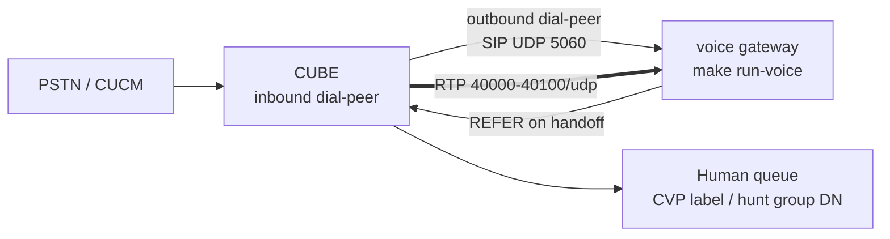

# Connecting the voice gateway to Cisco telephony

A step-by-step guide for a telephony team: first prove the gateway on a laptop with a
softphone (no Cisco gear, no cloud), then trunk a Cisco CUBE to it, then harden for
production. The architecture behind every step is in [the voice gateway design
doc](voice-gateway.md); this guide is the hands-on half.

The integration pattern is the vendor-neutral one: **CUBE routes the call to the gateway over
a SIP trunk (UDP signalling, G.711 mu-law RTP), and the gateway REFERs back for human
transfer.** The Cisco-managed alternatives (UCCE/Webex CC BYOVA, Google GTP SIP trunk) are
compared at the end.



## 1. Test on a laptop first (no Cisco, no cloud)

The local profile binds loopback and uses the offline scripted engine, so the whole call flow
(SIP, RTP, DTMF, the deterministic pipeline, the audit chain) runs with no credentials and no
network beyond your own machine.

```bash
python3.12 -m venv .venv && source .venv/bin/activate && make install
CONTACT_PROFILE=local CONTACT_SELF_SERVICE=on CONTACT_TENANT=demo-bank make run-voice
```

`CONTACT_TENANT` is required: with no tenant mapped for the dialled number (and `voice.dnis`
empty), the gateway refuses the call `503` at INVITE rather than answering a call it cannot
route to a tenant. Then register nothing and call directly: the gateway is a SIP endpoint, not
a registrar.

* **Linphone**: disable account registration, then call `sip:6001@127.0.0.1:5060`. Force the
  audio codec list to PCMU only (Settings, Audio codecs) so the offer matches what the
  gateway answers.
* **Zoiper**: create an account with host `127.0.0.1:5060`, registration off, PCMU enabled,
  DTMF mode RFC-2833, then dial `6001`.

What you should observe, in order:

1. The call answers. Offline the engine's audio is a SILENT, length-only stand-in (its
   pseudo-audio is zero PCM, which encodes to mu-law silence), so you will not hear the
   greeting; confirm the call is up by the steady RTP the gateway sends, not by listening.
2. Speaking produces no reply offline (the scripted engine replays fixtures rather than
   recognising a microphone); keying digits does drive the pipeline: enter `1234#` and the
   gateway runs the dialled string through the SAME gate the chat surface uses. Confirm the
   effect through the stored transcript or the chat surface for the same contact id, not by
   listening for speech.
3. Hanging up tears the call down. Mode gating: `contact_centre_conversations modes` shows the
   gate, and with `CONTACT_SELF_SERVICE` unset the gateway REFUSES TO START (`refused: ...`,
   exit 3) rather than binding a socket, so a softphone INVITE simply finds nothing listening.
   The mode gate refuses at boot, the same decision the HTTP surface makes, one layer earlier.

To hear the REAL engines from the laptop, keep the softphone rig and switch the profile:
`CONTACT_PROFILE=gcp` with application-default credentials uses the cascade engine
(region-pinned STT + synthesis). Gemini Live is a binding edit, not an env var: swap the
`voice_engine` gcp line in `config/settings.yaml` and `DEFAULT_BINDINGS` in `config.py` to the
Live adapter. Read the trade-offs in the design doc before that switch: it is a stated
residency and pre-redaction-audio deviation.

To demo across a LAN (softphone on a phone, gateway on the laptop), set
`CONTACT_VOICE_LAN_DEMO` deliberately and add the phone's address to
`CONTACT_SIP_PEER_ALLOWLIST`. Both are explicit acts; nothing opens by default.

## 2. Point a CUBE at it

Give the gateway host a static address the CUBE can route to, run it under the managed
profile, and allowlist the CUBE:

```bash
CONTACT_PROFILE=gcp CONTACT_SELF_SERVICE=on \
CONTACT_SELF_SERVICE_BUNDLE=<your promotion bundle> \
CONTACT_SIP_PEER_ALLOWLIST=192.0.2.5 \
CONTACT_VOICE_TRANSFER_TARGET=2000 \
make run-voice
```

Minimal CUBE-side configuration (IOS-XE), adjusted to your numbering:

```text
voice service voip
 ip address trusted list
  ipv4 198.51.100.20            ! the gateway host: without this CUBE rejects the calls
 sip
  ! keep REFER consumption on (default): CUBE consumes the gateway's REFER and
  ! re-routes by dial-peer digits. `supplementary-service sip refer` toggles pass-through.

dial-peer voice 6001 voip
 description inbound service number to the voice gateway
 destination-pattern 6001
 session protocol sipv2
 session target ipv4:198.51.100.20:5060
 session transport udp
 codec g711ulaw
 dtmf-relay rtp-nte
 voice-class sip options-keepalive up-interval 60 down-interval 30 retry 5
 no vad

dial-peer voice 2000 voip
 description the human queue the gateway transfers to (Refer-To digits 2000)
 destination-pattern 2000
 session protocol sipv2
 session target ipv4:<CVP or CUCM>
 codec g711ulaw
 dtmf-relay rtp-nte
```

Point by point, why each line matters to this gateway:

| CUBE setting | Why |
|---|---|
| `ip address trusted list` entry | CUBE refuses calls from and to untrusted addresses (toll-fraud protection); the gateway host must be listed |
| `codec g711ulaw` | The gateway answers PCMU only; any other offer is refused `488 Not Acceptable Here` |
| `dtmf-relay rtp-nte` | Digits arrive as RFC 4733 telephone-events, the one DTMF transport the gateway decodes |
| `options-keepalive` | CUBE probes with OPTIONS and busies the dial-peer out when the gateway is down; the gateway answers every OPTIONS with 200 |
| `no vad` | Comfort-noise suppression off, so caller audio frames flow continuously to recognition |
| REFER consumption (default on) | On handoff the gateway sends in-dialog REFER; CUBE consumes it and originates a new INVITE routed BY DIGITS. The Refer-To host is not what routes; make sure a dial-peer matches the digits in `CONTACT_VOICE_TRANSFER_TARGET` |

Session refresh: the gateway answers in-dialog re-INVITEs with the original SDP, so CUBE's
default session timer (1800 s refresh) passes. Media inactivity: the gateway sends continuous
RTP (silence while listening); if the trunk uses media-inactivity detection, key it on RTP,
not RTCP (the gateway does not send RTCP).

## 3. Carry context both ways

**Into the call.** ANI (From) and DNIS (To / request URI) are always available; the gateway
uses DNIS to route to a tenant, market and locale (`voice.dnis` in `config/settings.yaml`),
and never treats ANI as an identity. For a richer key, have CUBE inject a correlation header
with a sip-profile; the gateway honours `X-Contact-Id` from a TRUSTED peer when it matches
the contact-id shape, which is what lets a web-chat session continue over the phone:

```text
voice class sip-profiles 100
 request INVITE sip-header X-Contact-Id add "X-Contact-Id: <the web session's contact id>"
```

In practice the value comes from your IVR or web tier (the web chat shows or encodes the
contact id; your CVP/ICM script or session border logic maps the caller to it). Anything that
does not match the strict id shape is ignored and a call-derived id is used instead.

**Out of the call.** The handoff package (redacted transcript, verdicts, trigger, summary) is
routed to human review by rule R8, keyed by the same contact id. Passing bulk context in SIP
UUI is deliberately avoided: CVP expects GTD-encoded UUI bodies, header-style UUI is not
parsed by CVP, and both cap out around 128 octets. Pass the KEY in SIP; fetch the CONTEXT
over HTTP by that key. The `X-Handoff-Reason` header on the REFER carries the trigger for
quick routing decisions.

## 4. Network and placement

| Path | Ports | Notes |
|---|---|---|
| CUBE to gateway signalling | UDP 5060 (configurable) | Allowlist enforced at the gateway; unlisted hosts get no reply |
| CUBE to gateway media | UDP 40000 to 40100 (configurable) | One even port per concurrent call; keep the range narrow and firewalled to the CUBE addresses |
| Gateway to Google APIs | TCP 443 outbound | Cascade: `<region>-speech` / `<region>-texttospeech`; Live: the `voice.live_region` endpoint |

Placement options, in order of preference for a bank:

1. **Gateway on-premises, next to CUBE.** Lowest RTT, simplest firewalling; the managed
   engines are outbound 443 only. Avoid NAT between CUBE and the gateway; CUBE is itself the
   topology-hiding element.
2. **Gateway in GCP, private path.** Terminate SIP/RTP on a VM or GKE with a static internal
   address reached over Cloud VPN or Interconnect. Keep the RTP range narrow; DSCP marking
   survives only on the private path.
3. Public internet between CUBE and gateway is not a supported posture for this
   reference gateway (plain RTP, UDP SIP): put an SBC in front and encrypt there.

**SRTP.** The shipped gateway speaks plain RTP. Where the trunk requires SRTP (Webex Calling
trunks always; hardened enterprise trunks often), terminate SRTP on the SBC or on CUBE
(SRTP-RTP interworking is a supported CUBE function) and run plain RTP on the inner leg.

## 5. What you can only prove against real Cisco gear

The laptop rig proves the protocol surface, not the estate. Budget a test day for exactly
these, because no softphone exercises them:

* REFER handling in YOUR configuration: consume versus pass-through, and the dial-peer match
  for the transfer digits (including what happens when no dial-peer matches).
* OPTIONS keepalive cadence and dial-peer busyout/recovery when the gateway restarts.
* The `ip address trusted list`: confirm calls are rejected before the gateway allowlist ever
  sees them when the list is wrong, and that both lists agree.
* Early-offer versus delayed-offer behaviour of your CUBE version (the gateway expects an SDP
  offer in the INVITE; configure early-offer forced if your flow produces delayed offer).
* Session-timer re-INVITE cadence and media-inactivity settings against a long silent call.
* GTD/UUI behaviour through CVP if you pass context in-band rather than by correlation key.
* Codec renegotiation attempts mid-call (hold/resume music-on-hold flows), which the gateway
  answers with the original SDP.
* SRTP interworking, if the outer leg requires it.
* Load: the reference gateway is one asyncio process; measure your concurrent-call ceiling
  with your own audio profile before sizing production, and prefer an SBC or media-server
  front (see the comparison in the design doc) beyond double-digit concurrency.

## 6. Troubleshooting

| Symptom | Likely cause | Fix |
|---|---|---|
| INVITE gets no answer at all | Source host not on the gateway peer allowlist | Add the CUBE address to `CONTACT_SIP_PEER_ALLOWLIST`; unlisted hosts are ignored by design |
| `488 Not Acceptable Here` | Offer carried no PCMU | `codec g711ulaw` on the dial-peer (or fix the softphone codec list) |
| `503 Service Unavailable` at INVITE | No tenant mapped for the dialled DNIS and no default tenant | Map the number under `voice.dnis` in `config/settings.yaml`, or set `CONTACT_TENANT` |
| Gateway will not start (`refused: ...`, exit 3) | Self-service mode off, or mode misconfigured | `CONTACT_SELF_SERVICE=on` plus the promotion bundle under a deployed profile: the mode gate refuses at boot, before the socket binds, so nothing answers |
| Call answers, no greeting audio | RTP blocked one way (firewall, NAT) | Open the RTP range toward the gateway; check the SDP answer's address is routable from CUBE |
| One-way audio | NAT between CUBE and gateway rewriting one leg | Remove the NAT or front with an SBC; the gateway already answers wherever the peer's RTP actually comes from |
| Call drops around 30 s | ACK never arrived (signalling path asymmetric) | Ensure the 200 OK reaches the CUBE and the ACK can route back; check Via/rport handling on any middlebox |
| Call drops mid-call on silence | Media-inactivity timer keyed on RTCP | Key inactivity on RTP; the gateway sends continuous RTP but no RTCP |
| Digits not recognised | DTMF sent inband or via SIP INFO | `dtmf-relay rtp-nte` on the dial-peer; the gateway decodes RFC 4733 events only |
| Transfer never completes | No dial-peer matches the Refer-To digits | Add the dial-peer for `CONTACT_VOICE_TRANSFER_TARGET`; remember CUBE routes by digits, not by the URI host |
| Transfer completes but this leg stays up briefly | Peer sent no BYE after REFER | Expected: the gateway hangs up itself after the grace period |

## 7. The Cisco-managed alternatives

If the estate runs UCCE/PCCE 15.0(1) or Webex Contact Center, Cisco's **bring your own
virtual agent** connector streams the caller's audio to a gateway you host over gRPC or
WebSocket, and transfer, queueing and reporting stay native to ICM; no SIP stack is needed on
your side, at the cost of coupling to Cisco's contract (u-law 8 kHz, Control Hub onboarding,
the BYOVA schema). The deterministic pipeline and the `VoiceEnginePort` in this repository
are unchanged in that shape; only the transport front differs. Separately, CUBE 17.15.4+ is a
certified SBC for Google's own telephony SIP trunk, which hands the entire voice bot to
Google's managed Conversational Agents runtime rather than to this service. The full
comparison table is in [the design doc](voice-gateway.md).
