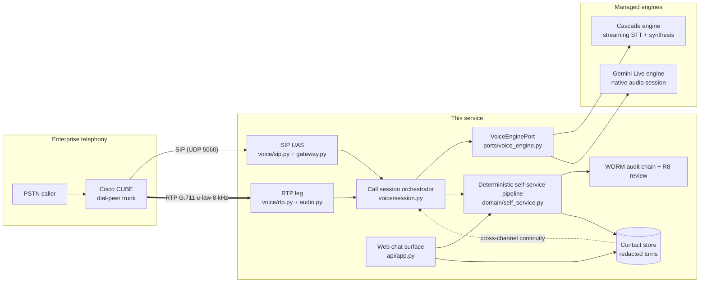
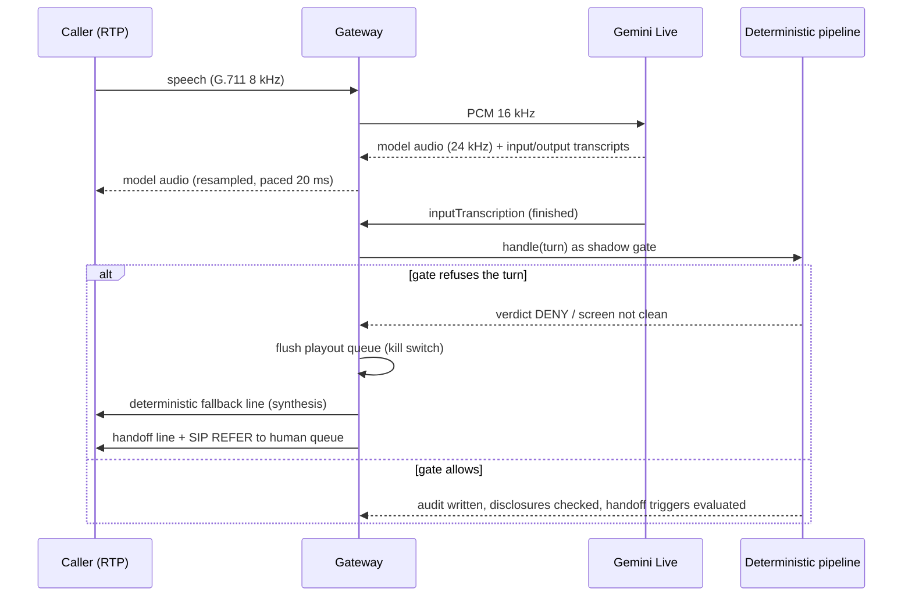
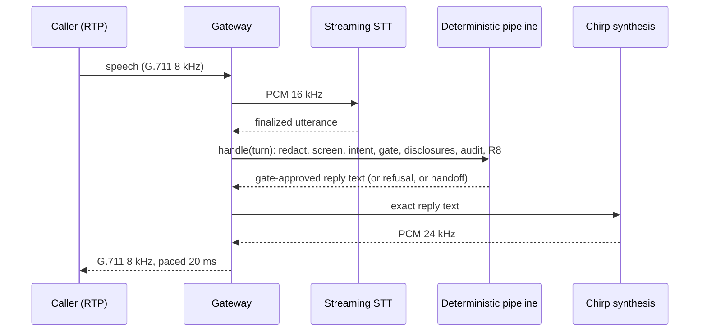
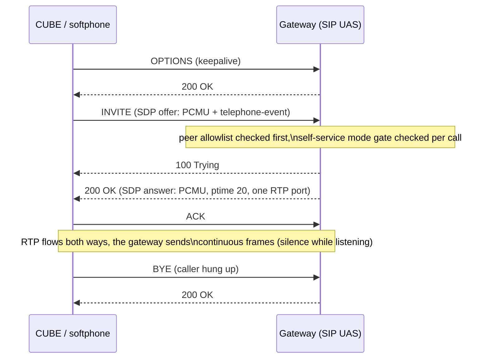
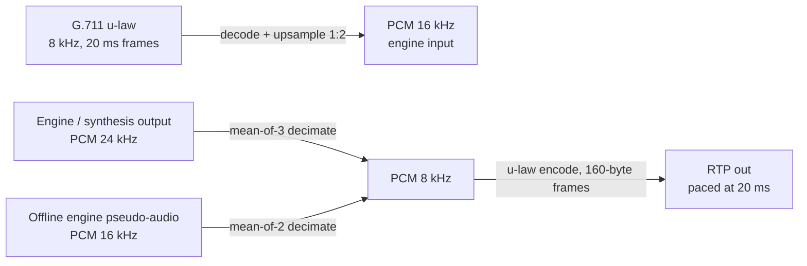
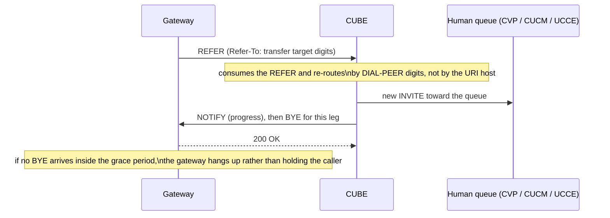
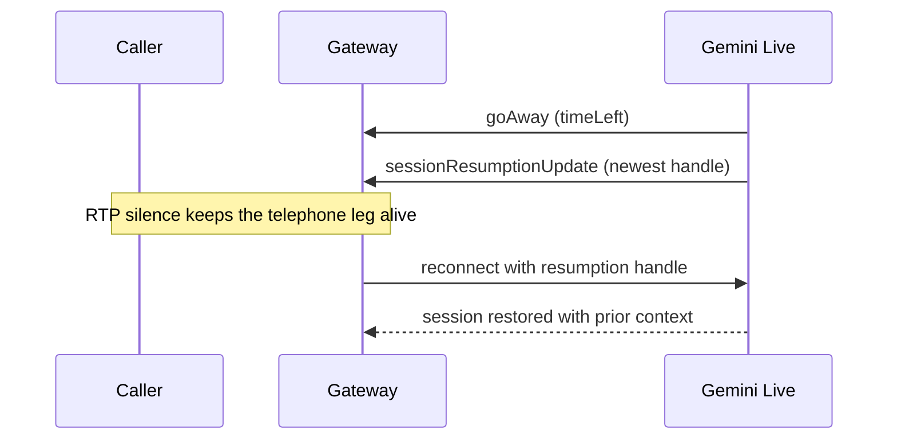
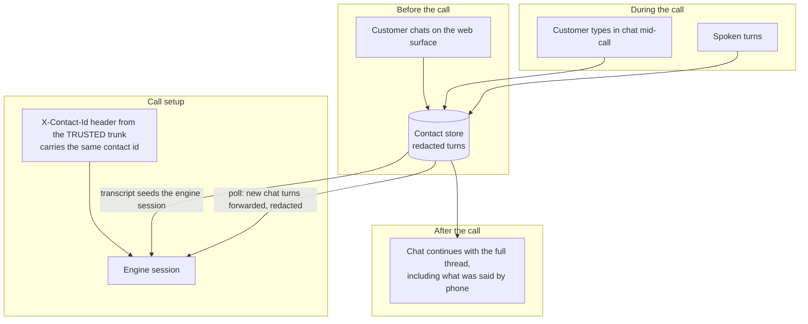

# The telephony voice gateway: how it works

The gateway lets an existing enterprise telephone estate reach the same deterministic
self-service pipeline the chat surface reaches. A Cisco CUBE dial-peer (or any SIP peer,
including a desk softphone) sends a call over SIP and RTP; the gateway terminates both, runs
the call through a pluggable realtime **voice engine**, and every consequential decision still
belongs to the deterministic pipeline: the intent allowlist, the policy gate, the disclosure
engine, the handoff triggers, the audit chain and rule R8 run identically for a phone call and
a chat message.

Connecting it to a real Cisco estate, and testing it with nothing but a laptop softphone, is
covered step by step in [the Cisco connection guide](cisco-connection-guide.md). This document
explains the architecture and the decisions inside it.

## The big picture

One port, three bound engine families, exactly like every other boundary in this repository:

| Binding | Adapter | What it is |
|---|---|---|
| `local` | `adapters/local/voice_engine.py` | Replays scripted contacts, echoes injected text, voices deterministic pseudo-audio. What the offline gate and the unit suite drive. |
| `gcp` (default) | `adapters/gcp/voice_cascade.py` | The cascade: streaming Speech-to-Text in, deterministic Chirp synthesis out. Region-pinned, invariant-clean. |
| `gcp` (opt-in) | `adapters/gcp/voice_live.py` | Gemini Live: a native audio-to-audio model session. Swapped in by configuration only, after the trade-offs below. |
| `onprem` | `adapters/onprem/voice_engine.py` | Fail-fast placeholder for a client's own realtime speech stack. |

## The two managed engines, and who authors the speech

The engine declares who authors the words a caller hears (`speech_authorship`, read exactly
the way the identity adapter's authentication declaration is read), and the orchestrator
derives its duties from the declaration. An engine that declares nothing is treated as
transcribe-only, the caller-safe default: its unsolicited audio is dropped as a defect, never
played to a member of the public.

| | Cascade engine (default) | Gemini Live engine (opt-in) |
|---|---|---|
| Who speaks | The deterministic pipeline authors every reply; Chirp voices it | The model speaks with its own voice |
| Invariants | All intact: redaction precedes the model, a denied turn never reaches it | Two stated deviations, below |
| Residency | Every leg region-pinned (`asia-southeast1` capable end to end) | Live serves US and EU regions only today; `voice.live_region` names the deviation |
| Latency feel | Good (streaming STT endpoint detection + synthesis per turn) | Best (server VAD, native barge-in, no synthesis hop) |
| Barge-in | Not in this reference build: queued playout plays to completion (the streaming recognizer still hears the caller for the next turn) | Native: the model stops itself and the gateway flushes |
| Tool use | The pipeline decides actions from intent + allowlist | The model may REQUEST allowlisted tools; the deterministic action gate still decides |
| Model lifecycle | STT and TTS models are GA and stable | The one GA Live model (`gemini-live-2.5-flash-native-audio`) retires 2026-12-13; the Gemini API models are Preview |
| Cost shape | Per audio minute (STT) + per character (TTS) + one grounded draft per turn | Per-turn billing over the WHOLE session context; context-window compression bounds it |

The two deviations the Live engine accepts, stated rather than hidden:

1. **Raw caller audio reaches the model before redaction.** Text can be redacted before a
   model sees it; a live audio stream cannot. Everything downstream is still redacted (the
   transcript, the store, the audit record), and the shadow gate below refuses outcomes, but
   the audio itself has left the boundary.
2. **The session runs outside the pinned region.** The deviation is configuration
   (`voice.live_region`), so it is chosen loudly or not at all.

A deployment that cannot accept either keeps the default cascade binding and deviates nowhere.

### The shadow gate and the kill switch

Behind the Live engine the deterministic pipeline still judges every finalized caller
utterance, from the live transcription, in parallel with the model's own reply. A turn the
gate refuses trips the kill switch: queued model audio is flushed before it plays, the
deterministic fallback line is voiced through synthesis (never through the model), and the
caller goes to a person. Deterministic prose is ALWAYS synthesis, in both engine postures,
because a native audio model paraphrases and a disclosure that got paraphrased was not made.

### The cascade turn

## Call setup and teardown

Refusals are SIP answers where a call reached a running gateway: an offer with no PCMU gets
488, a call whose dialled number maps to no tenant gets 503 at INVITE, a retransmitted INVITE
gets the answer retransmitted, and a datagram from a host not on the peer allowlist gets
nothing at all (an unlisted host learns nothing). One refusal happens earlier than any SIP
answer: a mode nobody enabled stops the gateway from STARTING (it refuses at boot, before the
socket binds), so a call to a disabled deployment finds nothing listening rather than a 503.

## The audio path

All three ratios are exact, the transcoder is standard library only, and the decimators are
mean-of-N (a crude anti-alias low-pass, adequate for a telephone band and stated as
reference-grade rather than presented as a polyphase filter). The pacing loop sends a frame
every 20 ms whether or not there is speech, because CUBE's media-inactivity detection watches
received RTP and an engine reconnect must not read as a dead call.

## DTMF

Digits arrive as RFC 4733 telephone-events on the negotiated payload type (Cisco convention
101). The collector deduplicates each key press, closes a dialled string on the terminator key
or on inter-digit silence, and the string then runs the SAME pipeline as speech: redacted,
screened, gated, stored, audited. Digits are frequently account numbers; nothing about arriving
as tones exempts them from the PII boundary.

## Handoff to a person

Handoff triggers are the deterministic ones the pipeline already owns (customer request,
vulnerability cue, screen block, repeated failed intent, consequential action, gate denial
behind an authoring engine). When one fires, the caller hears the deterministic handoff line
and the gateway sends an in-dialog REFER:

The handoff package (redacted transcript, gate verdicts, trigger, summary) is produced and
validated by the pipeline exactly as for chat, and the correlation key that lets the receiving
agent's desktop pop the same record is the contact id (see the connection guide's context
passing section).

## Session limits and reconnects

A Gemini Live websocket lives about ten minutes and warns with `goAway` before it ends; the
adapter surfaces that as a resumable close carrying the newest resumption handle. The
orchestrator reconnects behind the handle while the RTP leg keeps flowing (silence frames), so
the caller hears a pause, not a drop:

Context-window compression is enabled on the session for two reasons at once: it lifts the
session-length ceiling, and it bounds the per-turn re-billing of the whole context that the
Live API's pricing model applies.

## Switching between chat and voice

One contact, two surfaces, one store. The stored transcript is REDACTED by construction, so
seeding an engine from it cannot leak an identifier.

Within a call, text can also be pushed INTO a live audio session (the Live API accepts
realtime text alongside audio), which is what the mid-call chat bridge uses. The reverse
switch, voice output for a chat session, is a reconnect with a new session configuration:
one Live session has exactly one response modality, so "switching" is session succession with
context carried by the store and the resumption handle, never a mid-session toggle.

## What terminates SIP: the options compared

This repository ships the in-repo gateway because it makes the whole path inspectable and the
local test rig trivial. The alternatives below are real, and a deployment that prefers one
keeps everything above the `VoiceEnginePort` unchanged; the comparison is the SIP/media front
only.

| Option | What it is | Licence / cost | Local laptop rig | Cisco interop | Our code touches | Trade-off summary |
|---|---|---|---|---|---|---|
| In-repo gateway (shipped) | Python asyncio SIP UAS + RTP, G.711 only | Part of this repo | `make run-voice` + any softphone, zero extra pieces | CUBE trunks to it like any SIP endpoint; SBC in front for production | Everything (full control) | Simplest to read, test and modify; reference-grade SIP surface, no SRTP, interop burden is ours |
| Asterisk media over WebSocket | Asterisk >= 22.6 terminates SIP/RTP, hands 16 kHz PCM frames + JSON control (incl. DTMF events) over a WebSocket | GPL-2 (separate process) | One container + softphone registration | Battle-tested SIP; CUBE trunks into Asterisk | A WebSocket bridge instead of SIP/RTP | Production-grade telephony for one extra container; our process no longer speaks SIP |
| LiveKit (sip + agents) | SIP to WebRTC bridge into rooms; Python agents framework with a maintained Gemini Live plugin | Apache-2.0 | Official docker compose; macOS UDP quirks | REFER, DTMF, SRTP supported | Agent callbacks only; no frames | Most features for free; heaviest footprint (server, sip, redis) and the architecture becomes LiveKit's |
| jambonz | Full voice-AI platform (drachtio + rtpengine + FreeSWITCH) with a first-class Gemini Live connector and built-in barge-in | Commercial licence (free tiers) | No laptop compose; VM or cloud account | Carrier-grade SBC lineage | A JSON verb/webhook app | Most turnkey and telecom-grade; a platform dependency and a licence |
| Cisco BYOVA connector | UCCE 15.0(1) / Webex CC stream the caller to your gRPC or WebSocket gateway; no SIP stack at all | Cisco entitlements | Needs Cisco cloud onboarding | Native: queueing, reporting, transfer stay in ICM | A gRPC/WS service speaking Cisco's contract | The Cisco-sanctioned path when UCCE or WxCC is in place; couples the bot surface to Cisco's contract and codec (u-law) |
| Google GTP SIP trunk (managed) | CUBE (certified from 17.15.4) trunks into Google Conversational Agents; Google runs the whole voice bot | GCP pricing per second | No | Certified SBC pairing | Webhooks/tools only | Least to build, but the conversational loop runs inside Google's managed runtime rather than this pipeline |

## Latency budget

Target under 800 ms from end of caller speech to first reply audio; under 500 ms feels
excellent, beyond 1.5 s feels broken.

| Hop | Cascade | Live |
|---|---|---|
| PSTN + CUBE + network to gateway | 30 to 70 ms | 30 to 70 ms |
| Jitter buffer + transcode | under 25 ms | under 25 ms |
| Recognition finalization | 150 to 400 ms (endpointing) | inside the model's VAD |
| Decision pipeline (`handle`) | tens of ms offline; plus the grounded draft when a suggestion is produced | runs in parallel with the model's own reply |
| Synthesis first byte | 100 to 300 ms | not on the path (native audio) |
| Model first audio | n/a | 200 to 600 ms typical |

The pipeline runs off the event loop, so the audio path never blocks on a decision; behind the
Live engine the decision is a shadow that can only interrupt, which is why the Live path keeps
its native latency.

## What the offline gate proves, and what it cannot

The hard gate runs the whole orchestration against the scripted engine and a recording
transport: greeting, turn, gate, disclosure, kill switch, DTMF, reconnect, cross-channel
forwarding, wildcard refusals, codec refusals. It cannot prove interop with a live CUBE, the
managed recognizer, synthesis or the Live API; those are integration concerns and the
connection guide carries the explicit list of behaviours only a real Cisco estate can confirm.

Known limits of the shipped gateway, stated:

* Plain RTP only. SRTP terminates on the SBC in front (or CUBE keeps SRTP on the outer leg
  and sends RTP inside the enterprise boundary).
* G.711 mu-law only. A-law and Opus are answered 488; configure the dial-peer codec.
* No RTCP. Continuous RTP (silence while listening) is what keeps media-inactivity timers
  quiet; enable RTP-based inactivity detection rather than RTCP-based on the trunk.
* Reference resampling (mean-of-N decimation), fine for the telephone band.
* One codec answer, no re-negotiation mid-call beyond echoing the original answer.
